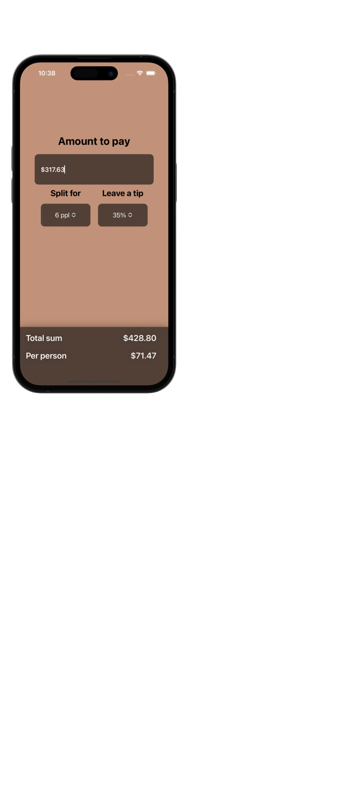

# &nbsp; WeSplit

### Project 1  
##### Author: *[MatviiArtemenko](https://github.com/100DaysOfSwiftUI-MatviiArtemenko)*

##### 100DaysOfSwiftUI form *[@twostraws](https://twitter.com/twostraws "twostraws twitter page")*

##### Follow along: *[100DaysOfSwiftUI](https://www.hackingwithswift.com/100/swiftui "Hacking with Swift")*

---

> *This project is a check-sharing app that calculates how to split a check based on the number of people and how much tip you want to leave. The project in itself isn’t complicated, but we’ll be taking it slow so you can see exactly how these fundamentals fit together.*

---

## &nbsp; 📚 Covered topics

  Form, Section, NavigationView, @State, @FocusState, TextField, Picker, ForEach

---
## &nbsp; 🎖 Challenge
* [x] Add a header to the third section, saying “Amount per person”

* [x] Add another section showing the total amount for the check – i.e., the original amount plus tip value, without dividing by the number of people.

* [x] Change the tip percentage picker to show a new screen rather than using a segmented control, and give it a wider range of options – everything from 0% to 100%. Tip: use the range `0..<101` for your range rather than a fixed array. 
 

---
## &nbsp; 📲 Screenshoot

 

  

<!-- add screenshots here!!! -->
---
##  &nbsp; 🔍 &nbsp; Resources 

* [Hacking With Swift - WeSplit](https://www.hackingwithswift.com/books/ios-swiftui/wesplit-wrap-up)
* [Apple documentation - FocusState](https://developer.apple.com/documentation/SwiftUI/FocusState)
* [Apple documentation - Keyboard support][def]

[def]: https://developer.apple.com/documentation/swiftui/view/keyboardtype(_:)